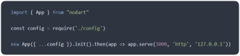

<div style="text-align:center">

<p>

</p>
</div>
<h3 style="text-align: center">NodArt - The Art of Node.js.</h3>
<h3 style="text-align: center"> A full-featured web framework for building progressive</h3>
<h3 style="text-align: center"> MVC OOP back-end applications. </h3>


---


The framework adheres to the concept of "just install and use". 
Everything you need to run a server application:

1. **Templating**
2. **Working with a session**
3. **ORM client, Working with databases (MySQL, PostgresSQL, SQLite, MSSQL, OracleDB, CockroachDB, Amazon Redshift)**
4. **Error and Exception handling**
5. **Working with a command line; Creation of custom commands**
6. **Routing**
7. **Custom events and states**
8. **Dependency injection**
9. **Observer pattern**
10. **Repository pattern**

Everything of this is provided out of the hood. 
All that is needed for some of the above things to work is to specify the basic settings 
in the configuration file. 

The framework provides a very flexible architecture, 
making it easy to extend and customize all of these things, 
up to and including completely changing the basic behavior 
by specifying class loaders and references in the same configuration file.


---


### INSTALLATION

### 1. GIT

it downloads the current framework version's application with full usage examples.

```
git clone https://github.com/nodart-labs/nodart-app.git
```

### 2. CLI

it creates a base application structure with some usage examples.

```
npx nodart create-app
```

---

<div style="text-align:center">

</div>

---

### RUN UNDER DEVELOPMENT SERVER
```
npm run dev
```

### RUN UNDER PRODUCTION
```
npm run start
```

---

### COMMAND LINE INTERFACE

### System Commands:
```
npx nodart [command name] [command action (optional)] --[argument name (optional)] [argument value]
```

### App Commands:
```
node cmd [command name] [command action (optional)] --[argument name (optional)] [argument value]
```

---


### DATABASE MIGRATION CLI

#### Creating and running a Single Migration
```
npx nodart migrate make --name migration-name
```
```
npx nodart migrate up | down
```

#### Creating and running the Group of Migrations in a single file
```
npx nodart migrate make-source --name source-name --migrations[optional] migration1 migration2 ...
```
```
npx nodart migrate source-up | source-down --name source-name --migrations[optional] migration1 migration2 ...
```

#### Roll back the latest migration
```
npx nodart migrate rollback --all[optional]
```

#### Run all migrations that have not yet been run
```
npx nodart migrate latest
```

#### Retrieve and return the current migration version
```
npx nodart migrate version
```

#### Return list of completed and pending migrations
```
npx nodart migrate list
```

#### Forcibly unlock the migrations lock table, and ensure that there is only one row in it
```
npx nodart migrate unlock
```

---

### DATABASE SEED CLI

#### Creates a new seed file, with the name of the seed file being added.
If the seed directory config is an array of paths, the seed file will be generated in the latest specified.
```
npx nodart seed make --name seed-name
```
```
npx nodart seed run
```

#### Creating and running the Group of Seeds in a single file
```
npx nodart seed make-source --name source-name --seeds[optional] seed1 seed2 ...
```
```
npx nodart seed source-run --name source-name --seeds[optional] seed1 seed2 ...
```

---

#### <font color=orange>Documentation is processing. The link will be soon available.</font>

